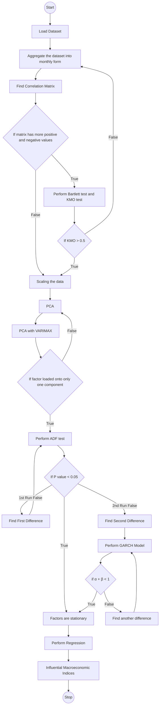
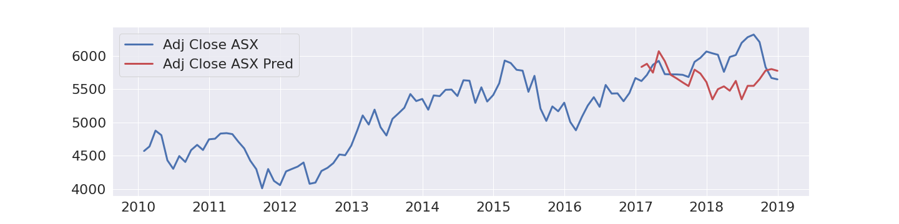
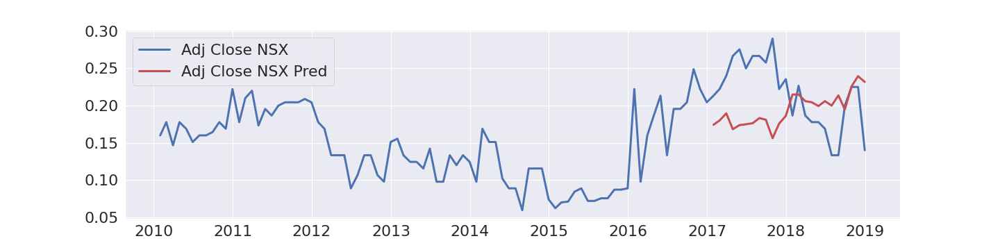

# Determining Influential Macroeconomic Indicators for the Australian Stock Market

This project focuses on using macroeconomic indicators to predict the performance of the Australian Stock Exchange (ASX) and National Stock Exchange (NSX). The data ranges from 2010-2018 and has been aggregated to monthly form. 

## Australian Macroeconomic Indices

 
 

<table align="center">
  <tr>
    <td> AUSBOT </td>
    <td> AUSBP </td>
    <td> AUSBR </td>
    <td> AUSCA </td>
    <td> AUSCARS </td> 
    <td> AUSCBBS </td>
  </tr>
  <tr>
    <td> AUSCCON </td>
    <td> AUSCCPI </td>
    <td> AUSCF </td> 
    <td> AUSCI </td> 
    <td> AUSCINF </td> 
    <td> AUSCNCN </td>
  </tr>
  <tr>
    <td> AUSCONPMI </td> 
    <td> AUSCOP </td> 
    <td> AUSCP </td>
    <td> AUSCPI </td>
    <td> AUSCPIC </td> 
    <td> AUSCSP </td> 
  </tr>
  <tr>
    <td> AUSCU </td> 
    <td> AUSCUR </td> 
    <td> AUSDINV </td>
    <td> AUSDPINC </td>
    <td> AUSEC </td> 
    <td> AUSEDBT </td>
  </tr>
  <tr>
    <td> AUSEMP </td>
    <td> AUSEXPX </td> 
    <td> AUSEXVOL </td>
    <td> AUSFDI </td> 
    <td> AUSFER </td> 
    <td> AUSFTEMP </td> 
  </tr>
  <tr>
    <td> AUSG </td> 
    <td> AUSGAGR </td> 
    <td> AUSGBGT </td>
    <td> AUSGBVL </td>
    <td> AUSGCP </td> 
    <td> AUSGD </td>
  </tr>
  <tr>
    <td> AUSGDG </td> 
    <td> AUSGFCF </td> 
    <td> AUSGNP </td>
    <td> AUSWAGE </td> 
    <td> AUSGOLD </td>
    <td> AUSGPC </td>
  </tr>
  <tr>
    <td> AUSGSP </td> 
    <td> AUSGYLD </td> 
    <td> AUSHOOD </td>
    <td> AUSIBOR </td> 
    <td> AUSIMPX </td> 
    <td> AUSIMVOL </td>
  </tr>
  <tr>
    <td> AUSINFEX </td> 
    <td> AUSJOBADV </td> 
    <td> AUSJVAC </td>
    <td> AUSLC </td> 
    <td> AUSLEI </td> 
    <td> AUSLFPR </td>
  </tr>
  <tr>
    <td> AUSLPS </td> 
    <td> AUSM1 </td> 
    <td> AUSM3 </td> 
    <td> AUSMANWG </td> 
    <td> AUSMKT </td>  
    <td> AUSMP </td> 
  </tr>
  <tr>
    <td> AUSMPMI </td> 
    <td> AUSNHS </td> 
    <td> AUSOIL </td> 
    <td> AUSPPI </td>
    <td> AUSPPIC </td> 
    <td> AUSPROD </td> 
  </tr>
  <tr>
    <td> AUSPSAV </td> 
    <td> AUSPTEMP </td> 
    <td> AUSRSY </td> 
    <td> AUSSPMI </td> 
    <td> AUSSSR </td> 
    <td> AUSSSRC </td> 
  </tr>
  <tr>
    <td> AUSSSRE </td> 
    <td> AUSTOT </td> 
    <td> AUSTOUR </td> 
    <td> AUSTVS </td> 
    <td> AUSUNP </td> 
    <td> AUSUNR </td> 
  </tr>
  <tr>
    <td> AUSUNRY </td>
  </tr>
</table>

 
 

## Data Reduction Tests

Before regressing the indices, the data has been put through data reduction tests to ensure the accuracy of the predictions. The tests included:

- Correlation
- Bartlett test
- KMO test
- Principal Component Analysis (PCA)
- PCA with VARIMAX

Out of seventy-nine indices, the indices which failed to load onto a factor or component in PCA with VARIMAX were dropped, and the iteration of PCA and PCA with VARIMAX continued. As per Eigen Values, K1-Kaiser test, for the data being used, there were nine components or factors. 

The indices which had the highest loading on to these respective components were put to ADF test to check for the stationarity of the time series data. This final data was used in regressing. 

## Future Work
In future work, this project can be extended to the prediction of the ASX and NSX stock markets could be improved with the help of Long-Short Term Memory from Recurrent Neural Networks, which works very comfortably with the time-series data.

## Methodology
The following flowchart explains the methodology used in this project.

## Technology Stack
The following technologies were used in this project:

- Python
- Pandas
- Numpy
- Scikit-learn PCA
- Scikit-learn StandardScaler
- Factor analyzer
- Matplotlib

## Regression Results

 
 

  

  ASX Prediction Accuracy: 94.81%

    

  

  NSX Prediction Accuracy: 74.57%

## Usage

The project is available as a Python notebook, and the dataset can be downloaded from the source.

## Contributions

Contributions are welcome! If you would like to contribute, please follow these steps:

1. Fork the repository.
2. Create a new branch for your feature or bug fix.
3. Write your code and add tests if necessary.
4. Commit your changes and push your branch to your fork.
5. Submit a pull request with a detailed description of your changes.

## Credits

This project was developed by Konda Vaishnavi, Manish Chandra Kadiyala, and Prakash K Aithal at Manipal Institute of Technology.
