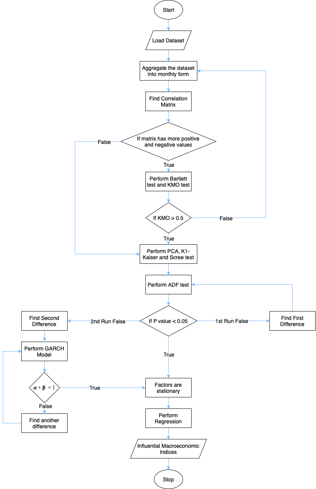

# Determining Influential Macroeconomic Indicators for the Australian Stock Market

### 79 Macroeconomic Indices

|--------|-------|-------|
| AUSBOT | AUSBP | AUSBR | 
* AUSCA 
* AUSCARS 
* AUSCBBS 
* AUSCCON 
* AUSCCPI 
* AUSCF 
* AUSCI 
* AUSCINF 
* AUSCNCN 
* AUSCONPMI 
* AUSCOP 
* AUSCP 
* AUSCPI 
* AUSCPIC 
* AUSCSP 
* AUSCU 
* AUSCUR 
* AUSDINV 
* AUSDPINC 
* AUSEC 
* AUSEDBT 
* AUSEMP 
* AUSEXPX 
* AUSEXVOL 
* AUSFDI 
* AUSFER 
* AUSFTEMP 
* AUSG 
* AUSGAGR 
* AUSGBGT 
* AUSGBVL 
* AUSGCP 
* AUSGD 
* AUSGDG 
* AUSGFCF 
* AUSGNP 
* AUSWAGE 
* AUSGOLD
* AUSGPC 
* AUSGSP 
* AUSGYLD 
* AUSHOOD 
* AUSIBOR 
* AUSIMPX 
* AUSIMVOL 
* AUSINFEX 
* AUSJOBADV 
* AUSJVAC 
* AUSLC 
* AUSLEI 
* AUSLFPR 
* AUSLPS 
* AUSM1 
* AUSM3 
* AUSMANWG 
* AUSMKT 
* AUSMP 
* AUSMPMI 
* AUSNHS 
* AUSOIL 
* AUSPPI 
* AUSPPIC 
* AUSPROD 
* AUSPSAV 
* AUSPTEMP 
* AUSRSY 
* AUSSPMI 
* AUSSSR 
* AUSSSRC 
* AUSSSRE 
* AUSTOT 
* AUSTOUR 
* AUSTVS 
* AUSUNP 
* AUSUNR 
* AUSUNRY

## Flowchart

  

